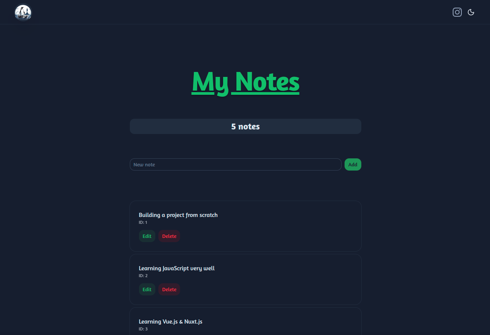

## App Preview



# Nuxt Notes App

A simple full-stack **Notes application** built with **Nuxt 4**, **Nuxt UI**, and **SQLite**.

This project demonstrates how to build a small CRUD application using Nuxt's full-stack capabilities, including server API routes, composables, and a database.

---

## Features

- Create notes
- View notes list
- Edit notes
- Delete notes with confirmation
- Input validation for empty notes
- Reactive UI built with Nuxt UI components
- SQLite database persistence
- Clean separation between UI, composables, API routes, and database logic

---

## Tech Stack

### Frontend

- Nuxt 4
- Vue 3
- Nuxt UI

### Backend

- Nuxt Server API routes (Nitro)

### Database

- SQLite
- better-sqlite3

---

## Project Structure
app/composables/useNotes.ts # Frontend logic and state management
app/pages/index.vue # Notes UI
app/utils/notes.ts # API wrapper for notes operations


server/api/notes.get.ts # Get all notes
server/api/notes.post.ts # Create a note
server/api/notes/[id].put.ts # Update a note
server/api/notes/[id].delete.ts # Delete a note
server/utils/db.ts # SQLite connection and table initialization


---

## How It Works

The application follows this flow:
User Action
↓
Page (index.vue)
↓
Composable (useNotes.ts)
↓
API Wrapper (utils/notes.ts)
↓
Server API Route
↓
SQLite Database


### Responsibilities

| Layer | Responsibility |
|------|----------------|
| `index.vue` | UI rendering and user interaction |
| `useNotes.ts` | Frontend state and logic |
| `utils/notes.ts` | API communication |
| `server/api/*` | Backend request handling |
| `db.ts` | Database connection and initialization |

---

## Installation

Clone the repository:

```bash
git clone https://github.com/thelinuxlighthouse/nuxt-notes-app.git
cd nuxt-notes-app
Install dependencies:
npm install 

Run the Development Server:
npm run dev

Open the application in your browser:

http://localhost:3000
```

## Database
The application uses SQLite with better-sqlite3.

The database file notes.db is automatically created when the server starts.

```sql
CREATE TABLE notes (
  id INTEGER PRIMARY KEY,
  text TEXT NOT NULL
);
```

## Future Improvements
Possible enhancements for this project:

- User authentication
- Notes per user
- Search and filtering
- Pagination
- Tags or categories
- GraphQL API alternative
- Deployment configuration

## Purpose of This Project
This project was built as a learning exercise to understand:

- Nuxt full-stack architecture
- API routes with Nitro
- Vue composables
- State vs derived state
- Clean separation of concerns
